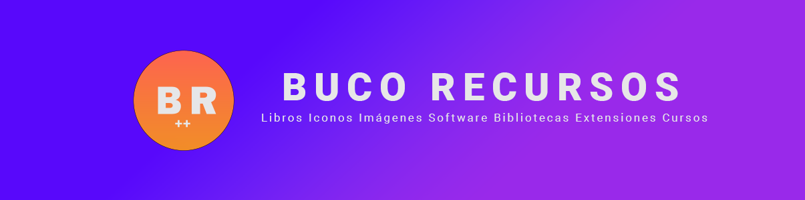

<a href="https://bucorecursos.vercel.app/">
  
</a>

<div align="center">
	<p>🚀 Lista de recursos gratuitos para desarrolladores web</p>


</div>

## Bucorecursos

Bucorecursos es una plataforma web que recopila recursos gratuitos en distintas categorías, como libros, iconos, imágenes, software, librerías, extensiones y cursos. Este proyecto es open source, por lo que cualquier persona puede contribuir y agregar nuevos recursos a la plataforma.

## 🚀 ¿Cómo participar?
Si quieres agregar un nuevo recurso a la plataforma, sigue estos pasos:

1. **Crea un fork de este repositorio**:

- Clic en _Fork_ en la esquina superior derecha o haz click [aquí](https://github.com/OmarCardoze/bucorecursos/fork).

3. **Clona el repositorio:**

```bash
git clone git@github.com:TU_USUARIO/bucorecursos.git
```

4. **Instala las dependencias:**

```bash
npm install
# o
pnpm install
# o
yarn install
```

5. **Agrega tu aportación en**:

Agregue el recurso aquí siguiendo la estructura: [`/data/resources.ts`](https://github.com/OmarCardoze/bucorecursos/blob/main/data/resources.ts).

Puedes agregar recursos con las siguientes categorías escritas en inglés: books, icons, images, software, libraries, extensions and courses.

```bash
  {
  id: 1,
  title: 'Título del recurso',
  description: 'Descripción del recurso',
  url: 'https://url-del-recurso.com/',
  categories: ['categoría-1', 'categoría-2'],
},
```

6. **Ejecuta el proyecto:**

```bash
npm run dev
# o
pnpm run dev
# o
yarn dev
```

7. **Haz commit**
Haz un commit con tus cambios y súbelos a tu fork con el comando git push.

8. **Crea un Pull Request**
Crea un pull request en este repositorio para que revisemos tus cambios y los integremos a la plataforma.


## Cómo reportar un error o proponer una mejora

Si encuentras un error o tienes una idea para mejorar la plataforma, por favor crea un issue en este repositorio. Asegúrate de proporcionar suficiente información para que podamos entender el problema o la mejora que propones.

## 🔑 License:

- [MIT](https://github.com/OmarCardoze/bucorecursos/blob/main/LICENSE)


